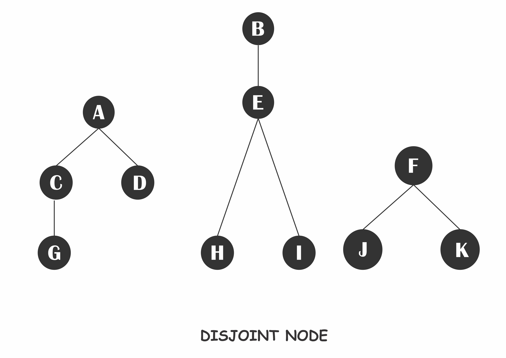
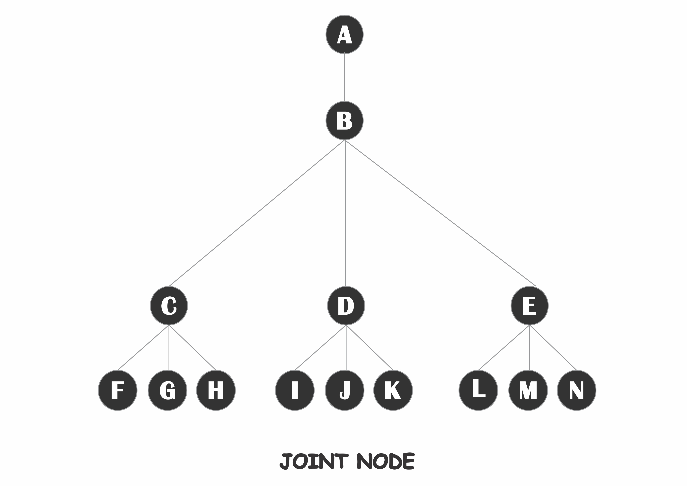

# Coding Challenge Reward System

> Implement a system for calculating rewards based on recommendations of customers.

## Technologies Used

- Ruby
- Rails API for backend web service
- HTML5 for UI app
- Rubocop for linting
- Prettier for formating
- `fly` for API deployment
- `netlify` for UI app

## Development (Running locally)

- Clone the project

```bash
git clone https://github.com/bolah2009/reward-system.git

```

- Install Dependencies

```bash
bundle install
```

- Start the server using:

```bash
rails server
```

- Access the API using the following curl command (or an API platform of your choice)

```bash
curl -X POST localhost:4000/rewards --data-binary @filename.txt -H "Content-Type: text/plain"
# this assumes that
# - you have a file named 'filename.txt' in the current directory the command is ran
# - you are running the local server on port 4000
```

## Running with the deployed version

### Live link

- [API Endpoint /rewards](https://reward-system-service.fly.dev/rewards)
- [UI Live Link](https://reward-system-service.netlify.app/)

- Access the API using the following curl command (or an API platform of your choice)

```bash
curl -X POST https://reward-system-service.fly.dev/rewards --data-binary @filename.txt -H "Content-Type: text/plain"
# this assumes that you have a file named 'filename.txt' in the current directory the command is run
```

- Access the API using [the UI app](https://reward-system-service.netlify.app/)
- Go to [reward-system-service.netlify.app](https://reward-system-service.netlify.app/) and either input your data on the text input or upload and file with the data
- On submit, a new page opens with the result provided the data is valid (more on valid data)

## Validation and assumptions used in the coding challenge

The data input is validated using the following criteria:

1. Each line denotes the instruction
2. Each line should be in the format
   - YYYY-MM-DD HH:MM USER_ONE recommends USER_TWO
   - YYYY-MM-DD HH:MM USER_ONE accepts
     where YYYY-MM-DD is the year-month-day format and HH:MM is a 24-hour format, USER_ONE and USER_TWO should be a word only character with no space or special characters
3. All inputs are case insensitive, this means that user "A" is the same as user "a", "accepts" is the same as "Accepts" and "ACCEPTS", etc
4. Only the first recommendation counts, that is if two users recommend the same user, and the user accepts, the recommendation only goes to the first (derived from the time) user
5. Each line is re-arranged chronologically in case it is not in chronological order, this way, the data parsed will be accurate since the logic is time sensitive
6. When a user (A) recommends another user (B) and B did not accept before recommending another user (C) the recommendation of A to B gets cancelled. This is implemented this way since scores are assigned after a user accepts an invitation and C acceptance only affects B at that point while B hasn't accepted A invitation. Also, in a real-life case, one can receive an invitation and not use the invitation code but instead sign up on their own.

## Implementation details

### Coding challenge

The coding challenge is solved with Ruby using the assumptions above, taking case insensitivity, time sensitivity and other constraints listed above into consideration.

- The tree-node data structure was used to keep track of associations of parents-children nodes with no limit of how deep the node children can be. The scores are assigned by transversing the node up to the parents' nodes and using the (1/2)^k points, where k is the level. This also takes consideration of disjoint and joined nodes as shown below where both cases is tested in the request test.

  |              Disjoint Nodes               |             Joined Nodes             |
  | :---------------------------------------: | :----------------------------------: |
  |  |  |

- The data is parsed using named captures Regex, this makes it easier to capture the data precisely without extra logic, however, this has a caveat for reducing how detailed the error messages can be without using extra logic.

- A validator is implemented to check for invalid input that can break the logic, so other invalid inputs that can be handled by the logic is ignored, for example, multiple invitation or multiple acceptance.

### Web service

A simple rails API is used to access the logic with either file upload or directly text params. I also provided a simple UI App to make manual testing easier with an API platform. The API has only a POST request that sends the data and returns a JSON response for either the scores or an error indication of what line the error occurred.

### Testing

Only request test is written, this was done to prevent regression when making changes or fixing bugs on the app. I would have loved to use unit testing and isolate the tests for each class as well but I use the request test to make the focus more on the coding challenge.

#### QA

To run the automated test, run

```
rspec --force-color --format documentation
```

To run Rubocop by itself, you may run the lint task:

```bash
rubocop
```

Or to automatically fix issues found (where possible):

```bash
rubocop -a
```

You can also check against Prettier:

```bash
npx prettier  --check "**/*.{html,md,json,yaml,yml}"
```

and to have it fix (to the best of its ability) any format issues, run:

```bash
npx prettier  --write "**/*.{html,md,json,yaml,yml}"
```

## 👤 Author

- Github: [@bolah2009](https://github.com/bolah2009)
- Twitter: [@bolah2009](https://twitter.com/bolah2009)
- Linkedin: [@bolah2009](https://www.linkedin.com/in/bolah2009/)

## 📝 License

[MIT licensed](./LICENSE).
